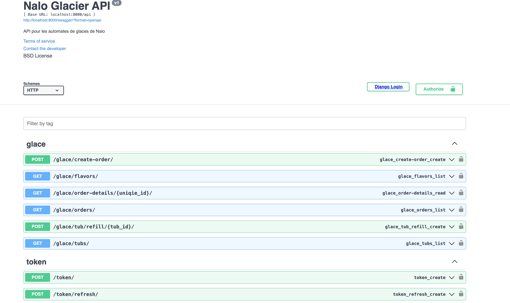
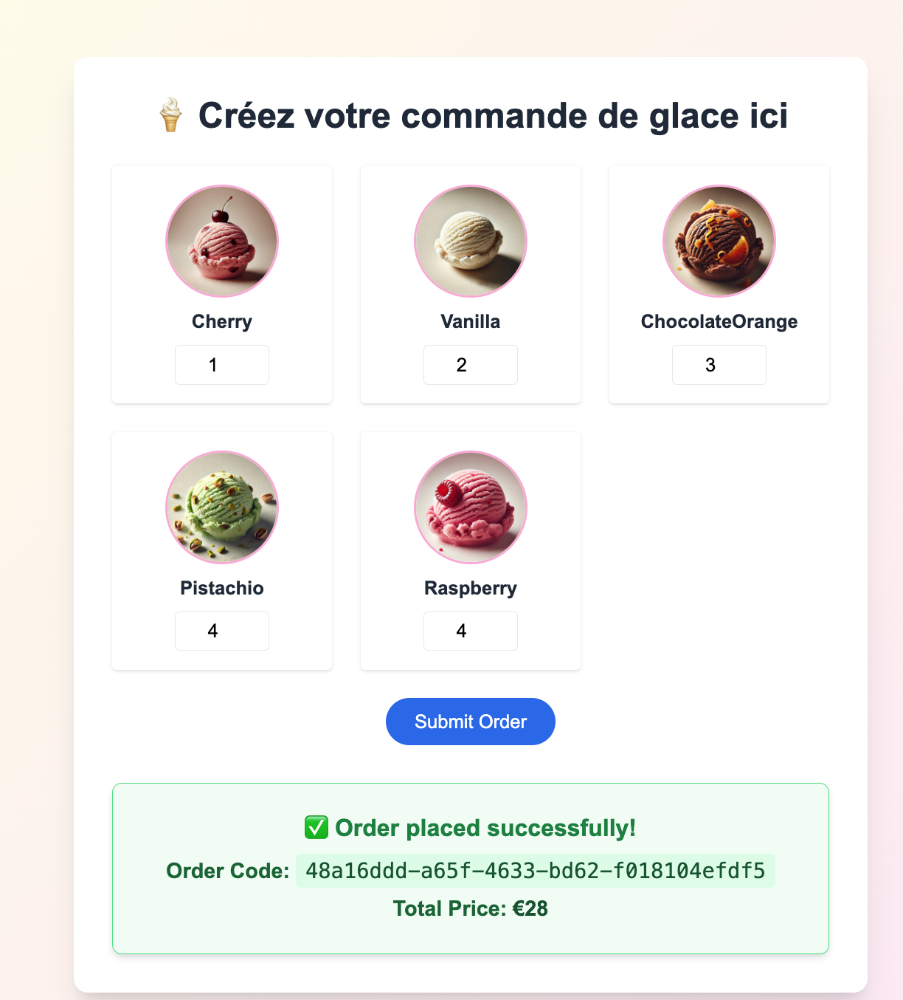
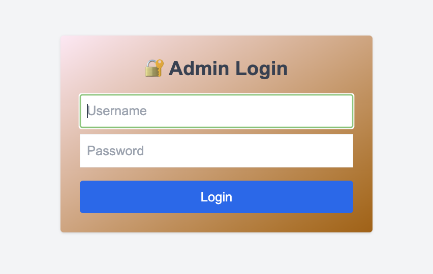
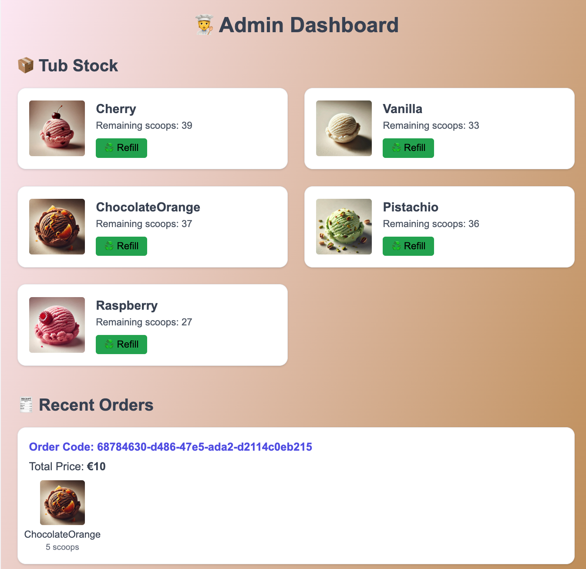
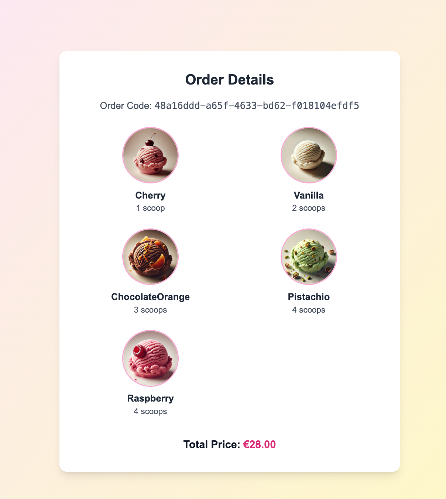
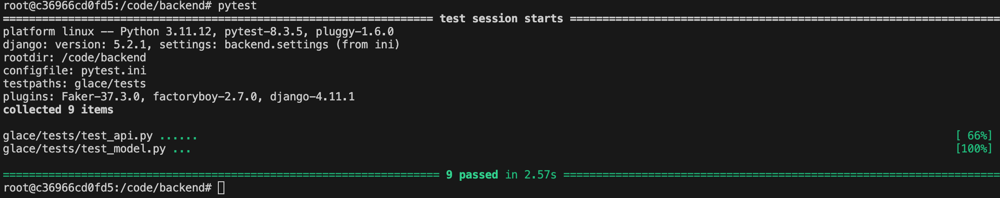
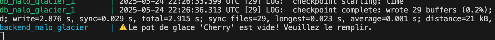

# Nalo lance le 1er glacier automate au monde !!

Tu es un nouveau développeur dans l'équipe Nalo, et ta première tâche consiste à développer le nouvel automate de Nalo.

On te laisse le goût du design. Nous te recommandons de consacrer entre 2 et 4 heures à cet exercice.

(Fais-en plus si tu veux 😇, fais-en moins si tu penses avoir montré tout ce qu'il faut 😎).

## Spécifications

Il y a 5 parfums de crème glacée disponibles :

- Chocolat Orange
- Cerise
- Pistache
- Vanille
- Framboise

Un pot de glace contient 40 boules.
Chaque boule coûte 2 euros.
Un utilisateur a le choix du nombre de boule et des parfums.

## Requis

- Une page doit permettre la saisie de la commande gérée en API, le prix sera retourné ainsi qu’un code aléatoire unique. Il faut gérer les problèmes de stocks !
- Une page doit permettre de récupérer la commande en entrant le numéro de commande, une représentation graphique de la glace (boule(s)) sera affiché à l'écran
- Une page administrateur permet de voir les recettes, le taux de remplissage des pots de glace
- Un bouton permet de remplir un pot vide, si un pot est vide un e-mail est envoyé à l’adresse de l’administrateur (un print suffit pour ce test)

## Instructions

- [ ] `fork` ce repository
- [ ] Initialise le projet Django
- [ ] Implémente les fonctionnalités requises
- [ ] Teste toutes tes fonctionnalités
- [ ] Publie-le sur GitHub en tant que `pull-request`
- [ ] Envoie-nous le lien et dis-nous approximativement combien de temps tu as passé sur ce travail.

##############################################################################################################################

# 🍦 Plateforme de Commande de Glaces Project Solution

Une application web full-stack agréable pour commander des glaces personnalisées en ligne — développée avec **Django REST Framework** et **Next.js**.

- 📦 Backend : TDD avec pytest + Django + DRF + PostgreSQL + Swagger
- 🖥️ Frontend : Next.js + Tailwind CSS
- 🔐 Authentification : Connexion administrateur via token
- 🧾 Fonctionnalités : Création de commande, visualisation, tableau de bord admin, Remplisage, se connecter

---

## ✨ Fonctionnalités

- ✅ Créer des commandes avec sélection de parfums et quantités
- ✅ Visualiser les commandes avec prix total et images
- ✅ Tableau de bord administrateur avec commandes récentes
- ✅ Authentification basée sur des tokens pour les administrateurs
- ✅ Interface utilisateur responsive et esthétique
- ✅ Configuration Docker pour le développement et la production

---

## 🛠 Technologies Utilisées

| Côté              | Stack                             |
| ----------------- | --------------------------------- |
| Frontend          | Next.js, TypeScript, Tailwind CSS |
| Backend           | Django, Django REST Framework     |
| Base de données   | PostgreSQL                        |
| Test              | Pytest (TDD-Backend)              |
| Authentification  | Token DRF                         |
| Déploiement       | Docker                            |
| API-Documentation | Swagger                           |

---

## 📸 Captures d'écran

### Open API

# Accès via :8000/swagger/



### Create Order

# Accès via :3000/



### Admin Login

# Accès via :3000/admin/login



### Current Status



### Order-details

# Accès via :3000/order/unique-id-uuid



### pytest



## comment exécuter le test ?

Démarrez Docker, exécutez le script bash de votre conteneur backend (normalement, son nom est backend_nalo_glacier) et exécutez la commande pytest.

### Django Signal message post Save pour le Notification


Lors de la prise de commande, si la capacité du pot devient 0, Django signale l'exécution d'un message d'impression (Future fonction d'envoi d'email).

### 🚀 Page de commande

L'utilisateur peut choisir les parfums et les quantités, puis passer la commande.

### 📜 Détails de la commande

Affiche les images, les boules sélectionnées, et le prix total.

### 🛠 Tableau de bord admin

Liste des commandes récentes avec détails et liens.

---

## 📦 Structure du Projet

```
.
├── backend/ # Backend Django
│ ├── manage.py
│ ├── backend/ # Répertoire du projet Django
│ ├── glace/ # Application principale
│ └── entrypoint.sh
├── frontend/ # Frontend Next.js
│ ├── app/ # Pages et composants
│ └── public/
│ └── images/ # Images des parfums
├── README.md
├── docker-compose.yml
├── Dockerfile.backend
├── Dockerfile.frontend
├── .env
└── .env.local

```

## 🚀 Démarrage Rapide

### 🔧 Configuration Backend

1. **Cloner le dépôt :**
   ```bash
   git clone https://github.com/NaloProject/Test-Backend.git
   cd Test-Backend
   ```

### 🔧 Configuration de l’environnement

À la racine du projet, créez l’un des fichiers suivants :

- `.env` – pour une utilisation générale
- `.env.local` – pour le développement local
- `.env.production` – pour la production

### Exemple de fichier `.env` :

````env
ENVIRONMENT=dev
CREATE_SUPERUSER=true
DJANGO_SUPERUSER_USERNAME=admin
DJANGO_SUPERUSER_PASSWORD=admin123
DJANGO_SUPERUSER_EMAIL=admin@example.com

n'oubliez pas de vérifier votre Email ou de me demander ce fichier car ce fichier peut ne pas être disponible sur github.

Les administrateurs se connectent via un système d’authentification par token.

Ajouter le token dans les en-têtes des requêtes API :

mais si vous accédez à partir du Web, il suffit de vous connecter pour que l'administrateur puisse remplir le pot de glace.

Authorization: Token <votre_token_ici>

📦 Déploiement avec Docker

# Construire et lancer les conteneurs

   docker-compose up --build


# Arrêter

docker-compose down

📬 Endpoints API
| Méthode | Endpoint | Description |
| ------- | ------------------ | ----------------------------- |
| GET | /api/glace/flavors/ | Liste des parfums disponibles |
| POST | /api/glace/create-order/ | Créer une commande |
| GET | /api/glace/order-details/<uniqie_id>/ | Détail d’une commande |
| POST | /api/token/ | Connexion admin |
| POST | /api/glace/tub/refil/{tub_id} | glace_tub_refill |
| GET | /api/glace/tubs/ | glace_tub_list |

```

# Solution supplémentaire

Le fichier db.json est disponible et permet de tester les données sans les créer manuellement.
Il suffit de faire


   python manage.py loaddata db.json


```
````
